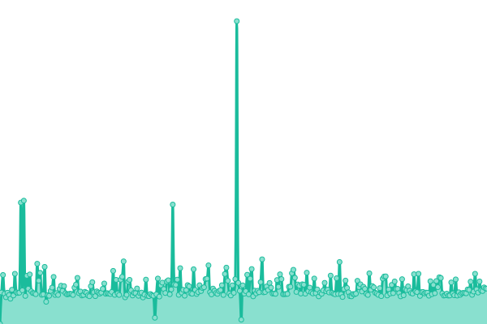
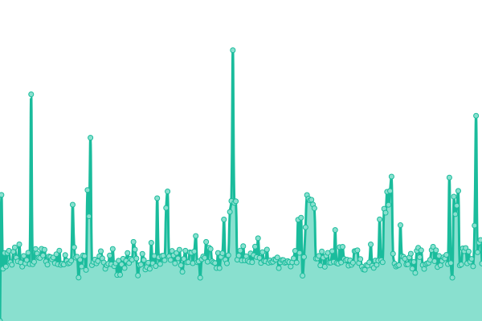
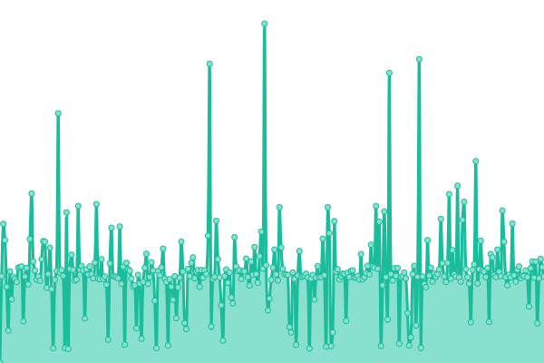
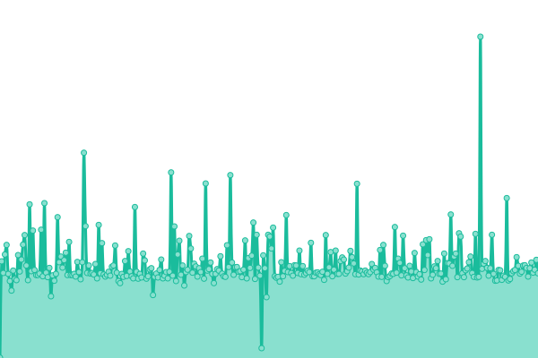
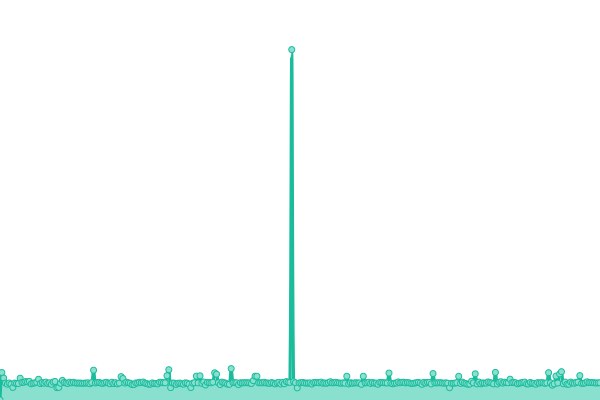

# [📈 Live Status](https://status.neumatic.ml): <!--live status--> **🟩 All systems operational**

This repository contains the open-source uptime monitor and status page for [neumaticc](http://neu.rf.gd), powered by [Upptime](https://github.com/upptime/upptime).

With [Upptime](https://upptime.js.org), you can get your own unlimited and free uptime monitor and status page, powered entirely by a GitHub repository. We use [Issues](https://github.com/neumaticc/pinger/issues) as incident reports, [Actions](https://github.com/neumaticc/pinger/actions) as uptime monitors, and [Pages](https://status.neumatic.ml) for the status page.

<!--start: status pages-->
<!-- This summary is generated by Upptime (https://github.com/upptime/upptime) -->
<!-- Do not edit this manually, your changes will be overwritten -->
<!-- prettier-ignore -->
| URL | Status | History | Response Time | Uptime |
| --- | ------ | ------- | ------------- | ------ |
|  [Neumatic.ML](https://neumatic.ml) | 🟩 Up | [neumatic-ml.yml](https://github.com/neumaticc/upptime/commits/HEAD/history/neumatic-ml.yml) | 

 339ms
     
 | 

<a href="https://status.neumatic.ml/history/neumatic-ml">100.00%</a>
    

|  [Forum.Neumatic.ML](https://forum.neumatic.ml) | 🟩 Up | [forum-neumatic-ml.yml](https://github.com/neumaticc/upptime/commits/HEAD/history/forum-neumatic-ml.yml) | 

 1240ms
     
 | 

<a href="https://status.neumatic.ml/history/forum-neumatic-ml">100.00%</a>
    

|  [CDN.Neumatic.ML](https://cdn.neumatic.ml) | 🟩 Up | [cdn-neumatic-ml.yml](https://github.com/neumaticc/upptime/commits/HEAD/history/cdn-neumatic-ml.yml) | 

 293ms
     
 | 

<a href="https://status.neumatic.ml/history/cdn-neumatic-ml">100.00%</a>
    

|  [Finn SMP](https://finnsmp.ml) | 🟩 Up | [finn-smp.yml](https://github.com/neumaticc/upptime/commits/HEAD/history/finn-smp.yml) | 

 316ms
     
 | 

<a href="https://status.neumatic.ml/history/finn-smp">100.00%</a>
    

|  [Pip SMP](http://www.pipsmp.ml) | 🟩 Up | [pip-smp.yml](https://github.com/neumaticc/upptime/commits/HEAD/history/pip-smp.yml) | 

 265ms
     
 | 

<a href="https://status.neumatic.ml/history/pip-smp">100.00%</a>
    

<!--end: status pages-->

[**Visit our status website →**](https://status.neumatic.ml)

## 📄 License

- Powered by: [Upptime](https://github.com/upptime/upptime)
- Code: [MIT](./LICENSE) © [neumaticc](http://neu.rf.gd)
- Data in the `./history` directory: [Open Database License](https://opendatacommons.org/licenses/odbl/1-0/)
